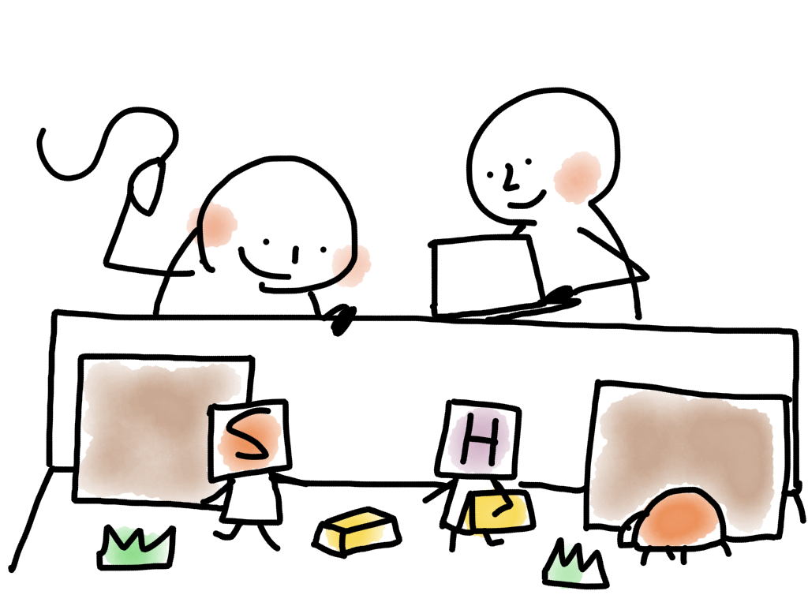

# Salesforce vs. Heroku

http://salesforce-vs.herokuapp.com/

SalesforceとHerokuの違いを説明するゲームです。
ポイント＆クリック(Salesforce)とコーディング(Heroku)でキャラクタを操作して勝敗を競います。

## 概要
ゲームフィールド上のキャラクタを動かしてゴールドを集めます。  
ただし、キャラクタはあらかじめプログラミングしたとおりにしか動きません。  
キャラクターがフィールドの範囲外にはみ出したりバグに捕まったりするとゲームオーバーです。  

キャラクタ同士が同時に同じフィールドに入ろうとした場合、元のフィールドに押し戻されます。  
つまり、その後のプログラムは自分の意図したルートを通らなくなります。

## コマンド
キャラクター操作のコマンドは以下の４つです。

- p.up(n) 上にn歩移動(引数省略時は1)
- p.down(n) 下にn歩移動(引数省略時は1)
- p.left(n) 左にn歩移動(引数省略時は1)
- p.right(n) 右にn歩移動(引数省略時は1)

Heroku側はエディタ上で上記のコマンドをタイプします。(コード補完あり)  
Salesforce側は矢印ボタンとUndo、DELボタンで操作します。(INSボタンは挿入モードと上書きモードの切り替えです。)

## 仕様
仕様書代わりのメモ

### URL
- ゲームのパスは「/game/XXXX」です。(XXXXの部分は任意)
- 同じURLを開いているユーザはゲームフィールドを共有しています。

### ゲーム設定
- リセットボタンを押すとゲームフィールドを再生成します。
- リセットボタンがクリックできる条件は以下です。
  - 自分がプレイヤーとしてエントリーしている場合
  - まだ誰もエントリーしていない場合
- 歯車のアイコンを押すと設定可能な項目が表示されます。
- 設定可能な項目は以下です。
  - フィールドの幅
  - フィールドの高さ
  - ゴールドの数
  - 壁の数
  - コーディングフェーズの時間(秒)
  - ゲームのターン数
  - 1ターンの時間(ミリ秒)

### ゲームへの参加
- Salesforce、またはHerokuのエントリーボタンを押すとゲームに参加出来ます。
- 一人のユーザがSalesforceとHerokuの両方にエントリーすることも可能です。

### ゲーム実行
- ゲームスタートボタンを押すことでゲームを開始します
  - ゲームスタートをクリック出来るのはゲームに参加しているユーザだけです。
- ゲームが開始されるとコーディングフェーズとなりカウントダウンの間プレイヤーはプログラミングできます。
  - テストボタンによってプログラミングによってキャラクタがどのように動くかがテスト出来ます。
  - 自分のテストだけでなく対戦相手の動きもテスト出来ます。
- コーディングフェーズが終了すると各キャラクタはプログラムに従って動きます。
- コーディングフェーズが終了し、ゲームがスタートしてもプログラミングは継続出来ます。
  - ただし、書いている途中でも時間が来るとその行が読み込まれて実行されるので注意が必要です。

### バグ
- ゲームが始まるとアルゴリズムに従って動きます。
- 動作アルゴリズムは以下です。
  - まずは上に行こうとする
  - 進行方向が壁、または外枠でないかぎり直進する
  - 進行方向が壁、または外枠の場合は右に曲がろうとする
  - 右側に行けない場合は左に曲がろうとする
  - そちらにも行けない場合は後ろに進む
- バグの動作もテストによって確認することができます。

### 勝敗
- ターン終了時にポイントの多い方が勝ちです。
- ゲーム途中でバグに捕まったり枠からはみだしたりすると即ゲームオーバーで負けです。
- 両者が同時にバグに捕まったり枠からはみだした場合は引き分けです。(それまでに取得したポイントは関係ありません)

### チャット
- おまけ
- 対戦者と観覧者が適当にチャットできる
- 無駄にポップアップ通知があったり
- リロードしてもチャットログは残る(sessionStorage利用)

